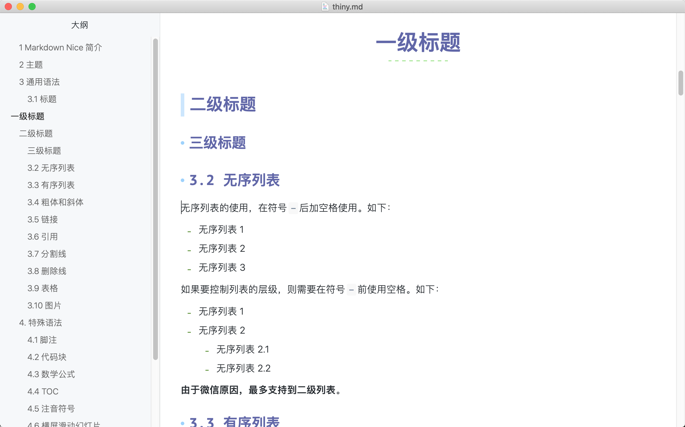
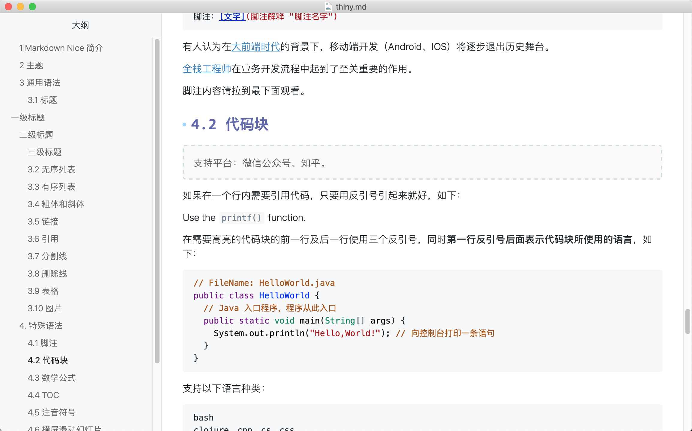

# typora-theme-thiny
A Typora theme, inspired by :

* [Misty](http://theme.typora.io/theme/Misty/)
* [Monospace](http://theme.typora.io/theme/Monospace/)
* [Scribble](http://theme.typora.io/theme/Scribble/)

> Note: Tested on macOS 10.15.7

It's a light theme. For more details, see http://theme.typora.io/

## Thiny

Download the thiny.css in this repository and will get as follows:

